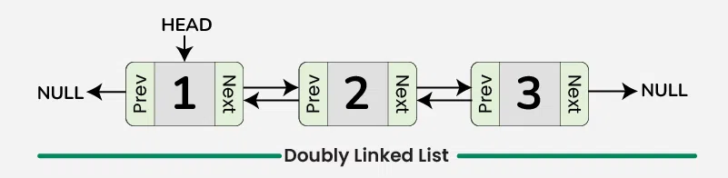
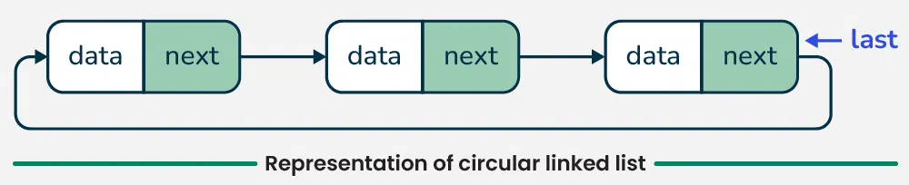
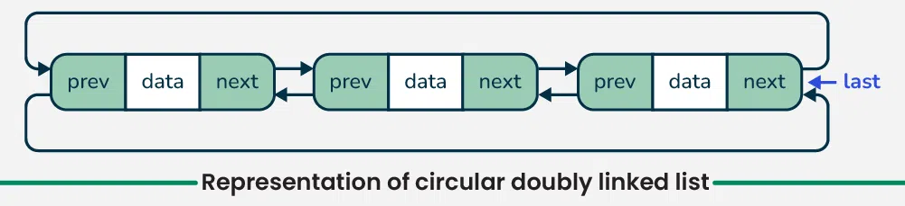

# 📒 **Linked List Notes**  

Linked Lists are one of the fundamental data structures in computer science, often used when the size of the data isn't fixed, or you need to perform frequent insertions and deletions.

---

## 📚 **What is a Linked List?**
A **Linked List** is a linear data structure where elements (called **nodes**) are connected using pointers.  
- Each node contains:
  - **Data**: The value stored in the node.
  - **Next**: A pointer/reference to the next node in the list.

---

## 🛠 **Types of Linked Lists**
1. **Singly Linked List**:  
   - Each node points to the next node.
   - Traversal is unidirectional.

   

2. **Doubly Linked List**:  
   - Each node has two pointers: one pointing to the next node and another to the previous node.
   - Traversal is bidirectional.
   
   

3. **Circular Linked List**:  
   - The last node points back to the first node, forming a circle.

   **There are two types of Circular Linked List**
   - Circular Linked List
   
   

   - Circular Doubly Linked List

   

---

### **What is a LinkedList?**
A **LinkedList** is a linear data structure where elements (nodes) are connected using pointers. Each node contains:
1. **Data**: The actual value.
2. **Pointer**: A reference to the next (or previous) node.

---

### **Why Use LinkedList?**
1. **Dynamic Size**: Can grow/shrink during runtime without resizing.
2. **Efficient Insertions/Deletions**:
   - Head/Tail: **O(1)** (no shifting like arrays).
   - Middle: **O(n)** traversal required.
3. **Low Memory Fragmentation**: Doesn’t require contiguous memory like arrays.
4. **Versatile Applications**:
   - Used in **queues**, **stacks**, **graphs**, **undo/redo**, etc.

---

### **Advantages**
- **Dynamic memory allocation**.
- **Fast insertions/deletions**.
- **Multiple traversal options** (with doubly/circular lists).

---

### **Disadvantages**
- **Sequential access**: Traversal is required (`O(n)`).
- **Higher memory overhead**: Extra pointers in each node.
- **Cache unfriendliness**: Non-contiguous memory allocation.

---

### **Applications**
1. **Queues**: Efficient FIFO operations.
2. **Undo/Redo**: In text editors or IDEs.
3. **Graph Representation**: Adjacency list.
4. **Operating Systems**: Memory allocation using free-lists.
5. **Music/Video Players**: Circular linked list for looping playlists.

---

### **Basic Operations**
| **Operation**           | **Time Complexity** |
|--------------------------|---------------------|
| Insert at Head           | O(1)               |
| Insert at Tail           | O(n)               |
| Insert at Specific Index | O(n)               |
| Delete at Head           | O(1)               |
| Delete at Tail           | O(n)               |
| Search                   | O(n)               |
| Reverse                  | O(n)               |

---
