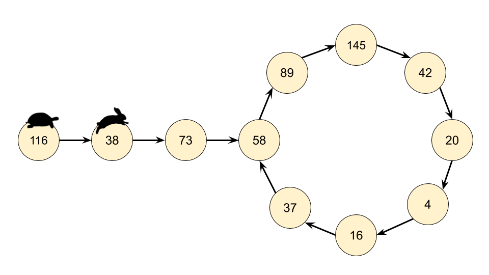

# **Singly Linked List**

### **Node Structure:**
```java
class Node {
    int data;
    Node next;

    // Constructor
    Node(int data) {
        this.data = data;
        this.next = null;
    }
} 
```

---

### **Basic Linked List Operations**

### **1️⃣ Insert at Head**  
This operation inserts a new node at the beginning of the list.

**Visual Representation**:  
```
Before Insertion:   Head -> [data1 | next] -> [data2 | next] -> null  
After Insertion:    Head -> [newData | next] -> [data1 | next] -> [data2 | next] -> null  
```

**Java Code**:  
```java     
class LinkedList {
    Node head;

    void insertAtHead(int data) {
        Node newNode = new Node(data);
        newNode.next = head; // Point new node to current head
        head = newNode;      // Update head
    }
}
```

---

### **2️⃣ Insert at Tail**  
This operation inserts a new node at the end of the list.

**Visual Representation**:  
```
Before Insertion:   Head -> [data1 | next] -> [data2 | next] -> null  
After Insertion:    Head -> [data1 | next] -> [data2 | next] -> [newData | next] -> null  
```

**Java Code**:  
```java
void insertAtTail(int data) {
    Node newNode = new Node(data);

    if (head == null) { // If list is empty
        head = newNode;
        return;
    }

    Node temp = head;
    while (temp.next != null) { // Traverse to the last node
        temp = temp.next;
    }
    temp.next = newNode; // Add the new node at the end
}
```

---

### **3️⃣ Insert at a Specific Position**  
This operation inserts a new node at the specified position in the list.

**Visual Representation**:  
```
Position = 2  
Before Insertion:   Head -> [data1 | next] -> [data2 | next] -> [data3 | next] -> null  
After Insertion:    Head -> [data1 | next] -> [newData | next] -> [data2 | next] -> [data3 | next] -> null  
```

**Java Code**:  
```java
void insertAtPosition(int data, int position) {
    Node newNode = new Node(data);

    if (position == 1) { // Insert at head
        newNode.next = head;
        head = newNode;
        return;
    }

    Node temp = head;
    for (int i = 1; i < position - 1 && temp != null; i++) { // Traverse to the position
        temp = temp.next;
    }

    if (temp == null) { // Position out of bounds
        System.out.println("Invalid position");
        return;
    }

    newNode.next = temp.next;
    temp.next = newNode;
}
```
### **Summary of Methods**

| **Operation**           | **Description**                            | **Time Complexity** | **Space Complexity** | **When to Use**                                                |
|--------------------------|--------------------------------------------|----------------------|-----------------------|----------------------------------------------------------------|
| **Insert at Head**       | Adds a new node at the beginning of the list. | **O(1)**             | **O(1)**              | When you frequently add elements to the start of the list.     |
| **Insert at Tail**       | Adds a new node at the end of the list.      | **O(n)**             | **O(1)**              | When appending elements to the end of the list.               |
| **Insert at Position**   | Adds a new node at a specific position.      | **O(n)**             | **O(1)**              | When you need to insert elements at arbitrary positions.       |


### **1️⃣ Delete the First Node**


**Visual Representation**:
```
Before Deletion: Head -> [data1 | next] -> [data2 | next] -> [data3 | next] -> null
After Deletion:  Head -> [data2 | next] -> [data3 | next] -> null
```

**Code**:
```java
void deleteFirst() {
    if (head == null) {
        System.out.println("List is empty. Nothing to delete.");
        return;
    }
    head = head.next; // Move the head pointer to the next node
}
```

---

### **2️⃣ Delete the Last Node**

**Visual Representation**:
```
Before Deletion: Head -> [data1 | next] -> [data2 | next] -> [data3 | next] -> null
After Deletion:  Head -> [data1 | next] -> [data2 | next] -> null
```

**Code**:
```java
void deleteLast() {
    if (head == null) {
        System.out.println("List is empty. Nothing to delete.");
        return;
    }
    if (head.next == null) { // Only one node
        head = null;
        return;
    }

    Node temp = head;
    while (temp.next.next != null) { // Traverse to the second-to-last node
        temp = temp.next;
    }
    temp.next = null; // Remove the last node
}
```

---

### **3️⃣ Delete a Node at a Specific Index**

**Visual Representation**:
```
Index to Delete = 1
Before Deletion: Head -> [data1 | next] -> [data2 | next] -> [data3 | next] -> null
After Deletion:  Head -> [data1 | next] -> [data3 | next] -> null
```

**Code**:
```java
void deleteAtIndex(int index) {
    if (index < 0) {
        System.out.println("Index cannot be negative.");
        return;
    }
    if (index == 0) {
        deleteFirst();
        return;
    }

    Node temp = head;
    for (int i = 0; i < index - 1; i++) {
        if (temp == null || temp.next == null) { // Out of bounds
            System.out.println("Index out of range.");
            return;
        }
        temp = temp.next;
    }

    if (temp.next != null) {
        temp.next = temp.next.next; // Skip the target node
    }
}
```

**Note- Nth Node From End- size-n +1**


---

### **Summary of Methods**
| Operation         | Time Complexity | Space Complexity |
|--------------------|----------------|-------------------|
| Delete First Node | O(1)           | O(1)              |
| Delete Last Node  | O(n)           | O(1)              |
| Delete at Index   | O(n)           | O(1)              |


---

#### **Search for a Value**
```java
boolean search(int key) {
    Node temp = head;

    while (temp != null) {
        if (temp.data == key) return true;
        temp = temp.next;
    }
    return false;
}
```

---


### 4️⃣ **Reversing a Linked List**
- Reverse the pointers of a linked list so the head becomes the tail, and the tail becomes the head.

---

#### **Java Code**
```java
class LinkedList {
    Node head;

    void reverse() {
        Node prev = null;
        Node current = head;

        while (current != null) {
            Node next = current.next; // Store next node
            current.next = prev;      // Reverse current's pointer
            prev = current;           // Move prev to current
            current = next;           // Move current to next
        }

        head = prev; // Update head to the new front (prev)
    }
}
```

#### **Visual Representation**


**Initial List**:  

```
- Head -> Data1 -> Data2 -> Data3 -> Data4 -> null  
```

**Step-by-step Process**:  

```
1. Reverse pointer of `Data1` to point to `null`.  
   - `Head -> null <- Data1    Data2 -> Data3 -> Data4 -> null`
2. Reverse pointer of `Data2` to point to `Data1`.  
   - `Head -> null <- Data1 <- Data2    Data3 -> Data4 -> null`
3. Reverse pointer of `Data3` to point to `Data2`.  
   - `Head -> null <- Data1 <- Data2 <- Data3    Data4 -> null`
4. Reverse pointer of `Data4` to point to `Data3`.  
   - `Head -> Data4 <- Data3 <- Data2 <- Data1 -> null`
```

**Final List**:

```  
- Head -> Data4 -> Data3 -> Data2 -> Data1 -> null 
```

---

#### **Time and Space Complexity**

| **Operation**       | **Description**                          | **Time Complexity** | **Space Complexity** |
|----------------------|------------------------------------------|----------------------|-----------------------|
| **Reverse LinkedList** | Reverse all the pointers of the list.    | **O(n)**             | **O(1)**              |

---

## 5️⃣ **Returning Full Linked List after manipulation**


#### **Sometimes we need to return 'head' of an LinkedList after manipulating it**

```java
ListNode temp = new ListNode(-1); //Stores Dummy Node
temp.next = head;

ListNode current = temp;


while(current.next != null){
    //Manipulation Operations
}

return temp.next;
```
---

## 🔢 **Utility Functions**

### 1️⃣ **Print the Linked List**
```java
void printList() {
    Node temp = head;

    while (temp != null) {
        System.out.print(temp.data + " -> ");
        temp = temp.next;
    }
    System.out.println("null");
}
```

---

### 2️⃣ **Find the Length of the Linked List**
```java
int getLength() {
    int count = 0;
    Node temp = head;

    while (temp != null) {
        count++;
        temp = temp.next;
    }
    return count;
}
```

---

### 3️⃣ **Detect a Loop in the Linked List**
Using **Floyd's Cycle Detection Algorithm**:

A **cycle (loop)** in a Linked List occurs when a node’s `next` pointer points to a **previous node** instead of `null`, creating an infinite loop.


```java
boolean detectLoop() {
    Node slow = head, fast = head;

    while (fast != null && fast.next != null) {
        slow = slow.next;
        fast = fast.next.next;

        if (slow == fast) return true; // Loop detected
    }
    return false;
}
```
---

### 4️⃣ **Remove a Cycle in a Singly Linked List**  

#### **Java Code for Finding the Start of the Cycle**
```java
Node detectCycleStart(Node head) {
    Node slow = head, fast = head;

    while (fast != null && fast.next != null) {
        slow = slow.next;
        fast = fast.next.next;

        if (slow == fast) {
            slow = head; // Reset slow to head
            while (slow != fast) {
                slow = slow.next;
                fast = fast.next;
            }
            return slow; // Cycle start node
        }
    }
    return null; // No cycle
}
```

---

### **3️⃣ Removing the Cycle**
To remove the cycle:
1. **Find the cycle's start node** using `detectCycleStart(head)`.
2. **Traverse to the last node in the cycle**.
3. **Set the last node’s `next` pointer to `null`**.

#### **Visual Representation**
```
Before Removal:
1 -> 2 -> 3 -> 4 -> 5
         ^         |
         |_________|

After Removal:
1 -> 2 -> 3 -> 4 -> 5 -> null
```

#### **Java Code to Remove the Cycle**
```java
void removeCycle(Node head) {
    Node start = detectCycleStart(head);
    if (start == null) return; // No cycle detected

    Node temp = start;
    while (temp.next != start) {
        temp = temp.next;
    }
    temp.next = null; // Break the loop
}
```

---

### **Full Implementation: Detect & Remove Cycle**
```java
class Node {
    int data;
    Node next;

    Node(int data) {
        this.data = data;
        this.next = null;
    }
}

class LinkedList {
    Node head;

    // Detect cycle using Floyd’s Algorithm
    boolean hasCycle() {
        Node slow = head, fast = head;
        while (fast != null && fast.next != null) {
            slow = slow.next;
            fast = fast.next.next;
            if (slow == fast) return true;
        }
        return false;
    }

    // Find cycle start node
    Node detectCycleStart() {
        Node slow = head, fast = head;
        while (fast != null && fast.next != null) {
            slow = slow.next;
            fast = fast.next.next;
            if (slow == fast) {
                slow = head;
                while (slow != fast) {
                    slow = slow.next;
                    fast = fast.next;
                }
                return slow;
            }
        }
        return null;
    }

    // Remove cycle
    void removeCycle() {
        Node start = detectCycleStart();
        if (start == null) return;

        Node temp = start;
        while (temp.next != start) {
            temp = temp.next;
        }
        temp.next = null;
    }
}
```

### **Key Takeaways**
✔ **Floyd’s Algorithm** helps in both **detecting** and **removing** cycles.  
✔ **Reaching the cycle start** takes at most **O(n)** steps.  
✔ **Breaking the cycle** ensures the Linked List returns to a normal structure.

---

### **When is Cycle Detection Used?**
✅ **Memory Management**: Detecting **infinite loops** in garbage collection.  
✅ **Networking**: Detecting **routing loops** in network graphs.  
✅ **Scheduling Algorithms**: Detecting **deadlocks** in CPU scheduling.  

---

### 5️⃣ **Remove Duplicates**
```java
void removeDuplicates() {
    Node current = head;

    while (current != null && current.next != null) {
        if (current.data == current.next.data) {
            current.next = current.next.next;
        } else {
            current = current.next;
        }
    }
}
```

---

## 🧩 **Common Linked List Problems**
1. **Find the Middle of a Linked List** (Using Slow and Fast Pointers)
2. **Merge Two Sorted Linked Lists**
3. **Delete the Nth Node from End**
4. **Check if a Linked List is Palindrome**

---

## 🚀 **Key Takeaways**
1. Linked Lists are dynamic and memory-efficient compared to arrays.
2. Operations like **insertion** and **deletion** are faster than arrays (O(1) for head operations).
3. Traversing is slower compared to arrays (O(n) for random access).
